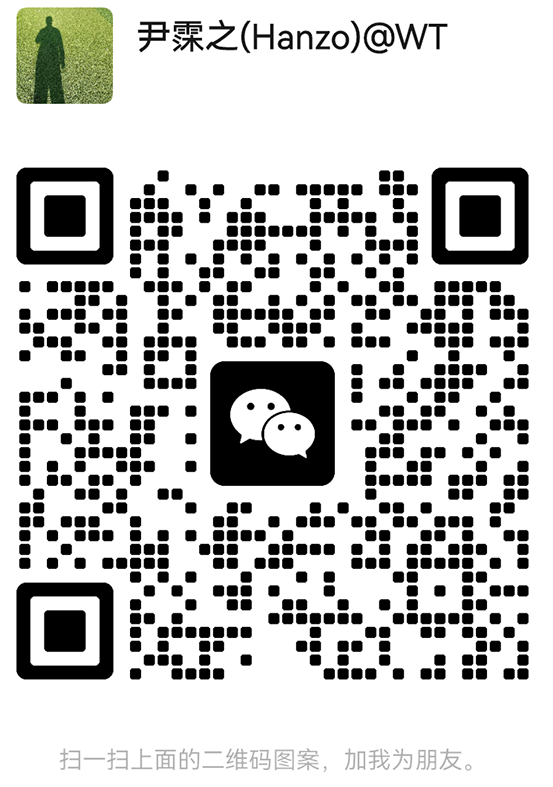
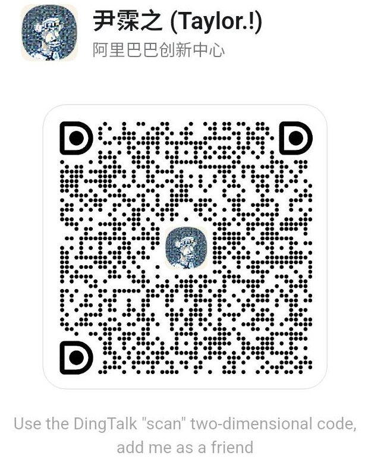

<div align="center">

# 网腾无限 AI - 网腾无限AI - 安全教育与应急预案专家

**[基于 Vue 3 + Vite + Vanilla CSS 构建的 网腾无限AI - 安全教育与应急预案专家 智能实战微应用，具备深色玻璃拟态自适应交互与微信端 H5 体验]**

[Vue 3] · [TypeScript] · [Vite] · [Vanilla CSS] · [开源协议 MIT]

[](https://github.com/WT-Agent/ai-anquan)
[](https://github.com/WT-Agent/ai-anquan/blob/main/LICENSE)
[](https://anquan.wuxian.xyz)

[在线演示](https://anquan.wuxian.xyz) · [快速启动](#快速启动) · [核心特性](#核心特性) · [脚手架集成](#脚手架集成说明) · [支持一下](#打赏支持)

</div>

---

## 团队与产品简介

团队成员均来自 C9 等顶尖学府，由字节、腾讯、阿里的资深工程师组成，全职创业研发开源 AI 微应用矩阵产品，旨在让所有人都能零门槛感受 AIGC 的生产力魅力。

**网腾无限AI - 安全教育与应急预案专家** 专注于“**你是一位国家注册安全工程师、企业安全生产高级培训师兼突发事件应急救援专家。你需要针对用户提供的作业场景/隐患描述/应急需求，以及用户选择的“安全场景预设（如：企业安全生产与隐患排查、突发事件应急预案演练、消防安全与疏散撤离、施工作业与安全防护规程）”、“应用行业分类（如：工矿制造/建筑施工/危险化学品/公共场所/交通运输）”、“培训对象级别（如：全员安全普及/特种作业人员/一线施工人员/安全管理人员）”，为用户生成一份严谨合规、实用可操作的【安全教育培训与应急处置指导方案】。内容必须包含以下 4 个标准模块：
1. 【安全风险与隐患识别诊断】：定位该场景下的潜在重大危险源、习惯性违章与设备事故隐患。
2. 【标准应急处置与疏散预案流程】：给出突发状况下按步骤响应的应急处置程序与人员撤离路线指导。
3. 【安全规范要点与防护装备清单】：明确强制执行的国家/行业安全生产标准（GB/AQ）及个人防护用品（PPE）配备。
4. 【班前安全宣导与演练培训指南】：提供适合班组晨会口播的安全宣导要点与应急演练考核指标。

请在回复的最后，根据你的专业评估给出该方案的【AI共识打分】（1-5分），格式必须严格如下（换行写入且不能有任何多余字符，以便前端自动解析）：
[ANQUAN_SCORES]riskIdentification:数字,emergencyFeasibility:数字,complianceStandard:数字,trainingClarity:数字,responseSpeed:数字[/ANQUAN_SCORES]
注意：[ANQUAN_SCORES]...[/ANQUAN_SCORES] 必须是回复的最后一小行，里面的“数字”只能是1到5之间的正整数。**”。我们剔除了冗余概念，不搞虚假宣传，只提供极致优雅、即调即用的高完成度微应用前端与边缘网关接口。

**我们不搞概念，不卖课，只写能跑起来的代码。**

欢迎 Star、Fork、提 Issue，一起让这个开源 AI 工具生态变得更好用。

---

## 核心特性

- **极简自适应交互**：采用极具现代感与科幻氛围的深色玻璃拟态 (Glassmorphic Dark UI) 设计，全量兼容移动端微信 H5 与 PC 响应式体验。
- **纯静态零成本部署**：架构保持 100% 静态化，无额外 Server 依赖，支持一键托管至 Cloudflare Pages、Vercel、GitHub Pages 或 CDN/OSS 静态存储。
- **安全代理与双模型网关**：内置安全开发代理中转层，支持无缝接入 DeepSeek-V3/R1 文本大模型及通义千问/通义万相多模态生图 API。
- **多维度评分与案例展示**：集成 AI 共识多指标看板、动态用户活跃跑马灯 ticker、精彩场景 Preset 案例以及生成卡片截图分享功能。
- **微信/钉钉双通道联系**：全量内置微信交流与钉钉联系双二维码组件，支持灵活的裂变锁屏与额度留存管理。

---

## 核心功能与使用场景

1. **智能 Prompt 场景引擎**：针对 **你是一位国家注册安全工程师、企业安全生产高级培训师兼突发事件应急救援专家。你需要针对用户提供的作业场景/隐患描述/应急需求，以及用户选择的“安全场景预设（如：企业安全生产与隐患排查、突发事件应急预案演练、消防安全与疏散撤离、施工作业与安全防护规程）”、“应用行业分类（如：工矿制造/建筑施工/危险化学品/公共场所/交通运输）”、“培训对象级别（如：全员安全普及/特种作业人员/一线施工人员/安全管理人员）”，为用户生成一份严谨合规、实用可操作的【安全教育培训与应急处置指导方案】。内容必须包含以下 4 个标准模块：
1. 【安全风险与隐患识别诊断】：定位该场景下的潜在重大危险源、习惯性违章与设备事故隐患。
2. 【标准应急处置与疏散预案流程】：给出突发状况下按步骤响应的应急处置程序与人员撤离路线指导。
3. 【安全规范要点与防护装备清单】：明确强制执行的国家/行业安全生产标准（GB/AQ）及个人防护用品（PPE）配备。
4. 【班前安全宣导与演练培训指南】：提供适合班组晨会口播的安全宣导要点与应急演练考核指标。

请在回复的最后，根据你的专业评估给出该方案的【AI共识打分】（1-5分），格式必须严格如下（换行写入且不能有任何多余字符，以便前端自动解析）：
[ANQUAN_SCORES]riskIdentification:数字,emergencyFeasibility:数字,complianceStandard:数字,trainingClarity:数字,responseSpeed:数字[/ANQUAN_SCORES]
注意：[ANQUAN_SCORES]...[/ANQUAN_SCORES] 必须是回复的最后一小行，里面的“数字”只能是1到5之间的正整数。** 领域进行了深度提示词工程优化与共识打分约束。
2. **多风格预设切换**：提供专业干练、高情商说辞、幽默风趣、严谨学术（或写真照片、卡通动漫等多模态）风格的一键切换。
3. **一键复制与卡片分享**：支持生成内容的快速复制，以及渲染结果的截图分享导出。
4. **统一 SSO 额度管理**：接入 wuxian.xyz 共享登录凭证，支持每日免费额度计数与登录解锁。

---

## 快速启动

### 1. 克隆项目
```bash
git clone https://github.com/WT-Agent/ai-anquan.git
cd ai-anquan
```

### 2. 安装依赖
项目推荐使用 `pnpm` 作为包管理器：
```bash
pnpm install
```

### 3. 配置环境变量
复制并配置本地开发环境变量：
```bash
cp .env.example .env
```
在 `.env` 中填入您的 API Key：
- `DEEPSEEK_API_KEY`: 您的 DeepSeek 开发者 API Key（用于文本类微应用）
- `DASHSCOPE_API_KEY`: 阿里 DashScope API Key（用于多模态生图微应用）

### 4. 启动本地开发
```bash
pnpm dev
```
启动后在浏览器打开控制台提示的本地开发地址即可进行调试。

---

## 脚手架集成说明

本微应用由私有总控仓库 `ai.wuxian.xyz` 中的运维脚手架统一管理，支持通过 CLI 进行批量更新与配置维护：

```bash
# 自动化发版与发布
node bin/cli.js publish ai-anquan

# 查看当前微应用配置
node bin/cli.js get ai-anquan

# 动态热更新提示词或模型映射
node bin/cli.js set ai-anquan prompt "你是一位国家注册安全工程师、企业安全生产高级培训师兼突发事件应急救援专家。你需要针对用户提供的作业场景/隐患描述/应急需求，以及用户选择的“安全场景预设（如：企业安全生产与隐患排查、突发事件应急预案演练、消防安全与疏散撤离、施工作业与安全防护规程）”、“应用行业分类（如：工矿制造/建筑施工/危险化学品/公共场所/交通运输）”、“培训对象级别（如：全员安全普及/特种作业人员/一线施工人员/安全管理人员）”，为用户生成一份严谨合规、实用可操作的【安全教育培训与应急处置指导方案】。内容必须包含以下 4 个标准模块：
1. 【安全风险与隐患识别诊断】：定位该场景下的潜在重大危险源、习惯性违章与设备事故隐患。
2. 【标准应急处置与疏散预案流程】：给出突发状况下按步骤响应的应急处置程序与人员撤离路线指导。
3. 【安全规范要点与防护装备清单】：明确强制执行的国家/行业安全生产标准（GB/AQ）及个人防护用品（PPE）配备。
4. 【班前安全宣导与演练培训指南】：提供适合班组晨会口播的安全宣导要点与应急演练考核指标。

请在回复的最后，根据你的专业评估给出该方案的【AI共识打分】（1-5分），格式必须严格如下（换行写入且不能有任何多余字符，以便前端自动解析）：
[ANQUAN_SCORES]riskIdentification:数字,emergencyFeasibility:数字,complianceStandard:数字,trainingClarity:数字,responseSpeed:数字[/ANQUAN_SCORES]
注意：[ANQUAN_SCORES]...[/ANQUAN_SCORES] 必须是回复的最后一小行，里面的“数字”只能是1到5之间的正整数。"
node bin/cli.js set ai-anquan model deepseek-chat
```

---

## 联系我们与打赏支持

如果您在使用过程中遇到问题，或希望与团队交流，欢迎扫码联系我们或打赏支持：

<div align="center">

**微信交流** | **钉钉联系**
:---:|:---:
 | 

</div>

---

- **官方网站**: [https://anquan.wuxian.xyz](https://anquan.wuxian.xyz)
- **GitHub Issues**: [提交反馈](https://github.com/WT-Agent/ai-anquan/issues)
- **反馈邮箱**: us@wuxian.xyz
- **官方主页**: [ai.wuxian.xyz](https://ai.wuxian.xyz)

---

## 版权与许可

本项目基于 **MIT License** 开源协议。

Copyright (c) 2026 [WangTeng.Tech](https://ai.wuxian.xyz). All rights reserved.
